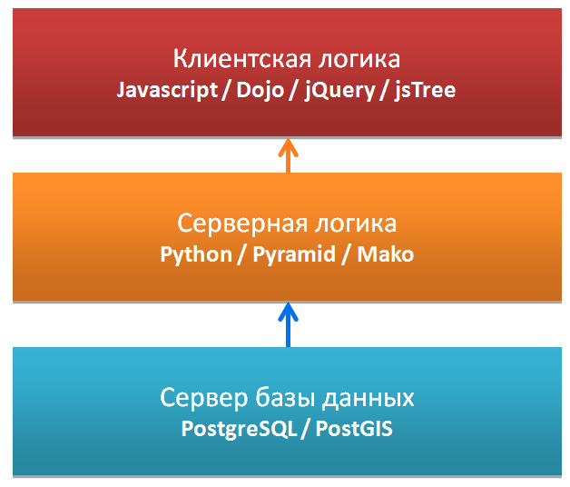
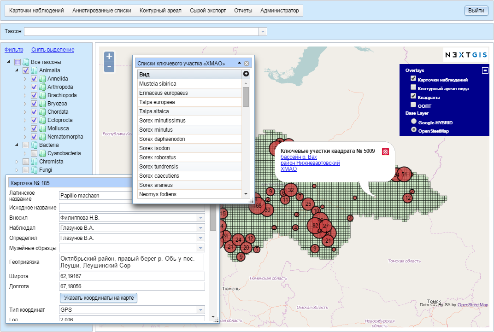

.. sectionauthor:: Иван Ковалев <ivan.kovalev@nextgis.ru>
.. sectionauthor:: Артём Светлов <artem.svetlov@nextgis.ru>
.. sectionauthor:: Дмитрий Барышников <dmitry.baryshnikov@nextgis.ru>

.. _general:

Общие сведения
==============

Назначение NextGIS Bio
----------------------

Информационная система по объектам животного и растительного мира NextGIS Bio предназначена для унифицированного сбора
и первичного анализа информации о биоразнообразии. Система служит как для прикладных управленческих задач, таких как
определение наличия краснокнижных видов на интересующей территории, так и для научных, например, для прогнозирования
ареалов редких видов или оценки степени редкости того или иного таксона.

Задачи NextGIS Bio
------------------

В задачи NextGIS Bio входит:

* обеспечение удаленного доступа к Базе Данных (далее БД)  о распространении биологических видов;
* осуществление сбора информации об объектах животного и растительного мира от респондентов (сотрудников ООПТ, профильных НИИ и университетов) посредством сети Интернет.
* обспечение возможности первичного (визуального) анализа распространения биологических таксонов на автоматически генерируемых из БД картах-схемах.
* обеспечение возможности использования исходных данных БД для различных методов анализа с использованием стороннего программного обеспечение (функция экспорта первичных данных).

Программная архитектура NextGIS Bio
-----------------------------------

С точки зрения программной архтектуры NextGIS Bio состоит из серверной и клиентской части. Схематически архитектурные компоненты системы можно изобразить в виде блок-схемы, приведенной на :numref:`ngbio_common_arch`

   Архитектура NextGIS Bio.

Серверная часть занимается хранением и обработкой пространственной и атрибутивной информации. Она разработана с использованием
языка программирования Python и веб-фреймворка Pyramid. Клиентская
часть предоставляет пользовательский интерфейс для интерактивного управления этим данными посредством браузера пользователя.

Клиент написан на языке JavaScript и построен на базе библиотеки Dojo. Конфигурация системы хранится внутри базы данных PostgreSQL с модулем расширения
:term:`PostGIS`. Разметка страниц интерфейса пользователя проводится с 
использованием языка разметки HTML. Оформление страниц интерфейса пользователя 
производится с использованием таблиц описания стилей – CSS.

NextGIS Bio работает во всех современных браузерах.
Внешний вид пользовательского интерфейса с опубликованной веб-картой представлен 
на :numref:`ngbio_img_bio_common`.

   Пользовательский интерфейс главной страницы NextGIS Bio.

