.. sectionauthor:: Иван Ковалев <ivan.kovalev@nextgis.ru>

.. _ngb_ui_general:

Пользовательский интерфейс NextGIS Bio
======================================

Основные компоненты
-------------------

Интерфейс NextGIS Bio включает следующие блоки (см. рис. :numref:`ngbio_img_ui_common`):

1. Панель авторизации - механизм разграничения прав доступа к ИС.
2. Панель редактора - интерфейс для создания новых карточек встреч краснокнижных видов и аннотированных списков живых организмов.
3. Панель поиска по таксонам - механизм выбора необходимых таксонов (от царства до подвидовых таксонов) для отображения на карте-схеме.
4. Панель управления отображения слоев - интерфейс для выбора картографических подложек и слоев ИС.
5. Панель дерева таксонов - обеспечивает удобную навигацию по дереву таксонов.
6. Окно  карты - отображает выбранную пользователем конфигурацию слоев и таксонов.

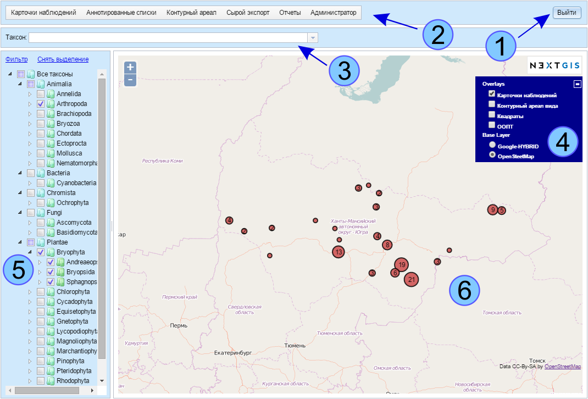

   Структура главной страницы пользовательского интерфейса NextGIS Bio (цифрами обозначены: 1 - панель авторизации, 2 - панель редактора, 3 - панель поиска по таксонам, 4 - панель управления отображения слоев, 5 - панель дерева таксонов, 6 - окно  карты).

Панель авторизации
------------------

Механизм разграничения прав доступа к системе, поддерживающий три уровня доступа посредством ввода имени пользователя (логина) и пароля:

1. Неавторизованный пользователь, заходя на сайт, имеет права только на просмотр информации, при этом часть информации (координаты точек встреч) не доступна. Кроме того, точки на карте сдвигаются на случайное расстояние в радиусе 10 км.
2. Редактор, в случае, если пользователь авторизован как редактор (ввел соответствующие выданные ему заранее пару логин / пароль),  он получает права просмотр всей имеющейся информации и на редактирование записей в БД.
3. Администратор, помимо стандартных прав редактора, получает дополнительную возможность массового импорта в БД. Использование прав администратора требует глубокого понимания устройства системы.

Панель поиска по таксонам
-------------------------

Предназначена для поиска произвольного таксона: пользователь набирает часть названия таксона, 
например рода в панели поиска, и получает список таксонов, удовлетворяющий критерию поиска. 
Внешний вид панели приведен на :numref:`ngbio_ui_taxons_search`

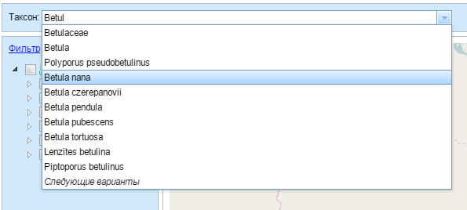

   Панель поиска по таксонам.

Поиск осуществляется по латинским и русским названиям таксонов, а также по их синонимам.

Навигационная панель «Иерархическое дерево таксонов»
----------------------------------------------------

Панель представляет из себя систему вложенных друг в друга выпадающих списков согласно 
иерархической системе биологических таксонов: 
Царство/Филум/Класс/Отряд(Отдел)/Семейство/Род/Вид (:numref:`ngbio_ui_taxons_tree`).
Панель служит для навигации по базе данных и визуализации имеющейся в ней информации 
о данном конкретном таксоне.
Выбор того или иного таксона или совокупности таксонов приводит к отображению информации 
о них на карте-схеме.

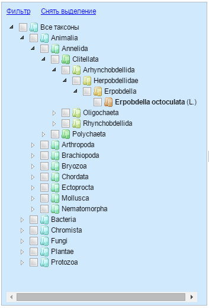

   Иерархическое дерево таксонов.

Панель «Слои»
-------------

Панель «Cлои» предназначена для управления отображением картографических слоев (:numref:`ngbio_ui_maps_layers`). Включает в себя два типа картографических слоев:

1. Подложки - выполняют вспомогательную функцию.

- OpenStreetMap - это топооснова, в качестве которой выбрана карта OpenStreetMap [osm] распространяемая по свободной лицензии (CC-BY-SA)
- Google-HYBRID - подложка из мозаики космических снимков Google Map [gm].

2. Слои базы данных.

- карточки наблюдений - автоматически генерируемая по запросу из БД карта-схема точек встреч краснокнижных видов.
- контурный ареал вида - автоматически генерируемая по запросу из БД карта-схема ключевых участков, 
для которых искомые таксоны указаны в таблице «аннотированные списки».
- квадраты - схема расположения всех квадратов картографической сетки с указанием номера квадрата и всех ключевых участков, в которые он входит.
- ООПТ - слой границ ООПТ предоставленный Департаментом экологии ХМАО.

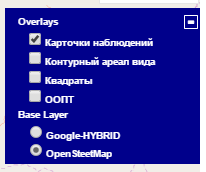

   Панель «Слои».

Панель редактора
----------------

Панель редактора служит для:

- создания посредством соответствующих форм ввода новых карточек встреч краснокнижных 
видов (см. раздел «Формы ввода»).
- редактирования аннотированных списков видов.
- экспорта результатов поиска по БД в текстовые и шейп-файлы для последующего анализа 
с использованием стороннего ПО (QGIS, ArcGIS, MapInfo и др.).

Формы ввода
-----------

Для ввода информации зарегистрированными пользователями предусмотрены формы ввода. 
Формы ввода делятся на две основные группы: формы ввода карточек встреч краснокнижных 
видов и формы ввода аннотированных списков. Поля форм для различных групп живых организмов 
отличаются, поэтому для них созданы отдельные формы:

- Карточки встреч млекопитающих.
- Карточки встреч птиц.
- Карточки встреч рептилий, амфибий и рыб.
- Карточки встреч беспозвоночных.
- Карточки встреч сосудистых растений.
- Карточки встреч мхов.
- Карточки встреч грибов и лишайников.

- Аннотированные списки млекопитающих.
- Аннотированные списки птиц.
- Аннотированные списки рептилий, амфибий и рыб.
- Аннотированные списки беспозвоночных.
- Аннотированные списки сосудистых растений и мхов.
- Аннотированные списки грибов и лишайников.

Инструменты экспорта и импорта
------------------------------
Инструмент экспорта активен в режимах редактора и администратора ИС и обеспечивает экспорт информации, содержащейся в ИС в следующих форматах:

- csv-файл: для таблиц «таксоны», «аннотированные списки», «карточки учета». Обеспечивает возможность экспорта внесенной респондентами информации в виде стандартизованного текстового (csv-файла) с разделителями табуляции.
- shape-файл (один из общепринятых стандартов ГИС): для данных схем «карточки наблюдений» и «контурный ареал». Данные файлы могут быть напрямую загружены во многие сторонние ГИС пакеты, такие как QGIS, MapInfo, ArcGIS и др.

Инструмент импорта активен только в режиме администратора ресурса. Обеспечивает импорт в БД заранее подготовленной администратором информации для всех имеющихся в БД таблиц (подробнее, см. раздел «Импорт данных»).

Использование системы в режиме редактора
----------------------------------------

Создание и редактирование карточек встреч краснокнижных видов
~~~~~~~~~~~~~~~~~~~~~~~~~~~~~~~~~~~~~~~~~~~~~~~~~~~~~~~~~~~~~

В данном разделе описан алгоритм заполнения полей общих для всех карточек учета редких таксонов, а также рассмотрены особенности заполнения специфических полей карточек встреч организмов, относящихся к разным систематическим группам.
Поля базы данных и их наполнение были разработаны по ходу введения информации из отчетов по НИР и статей. 
В случае необходимости, можно уточнить имеющиеся поля и их атрибутику, а также создать новые: 
для этого свои замечания и пожелания необходимо обнародовать для обсуждения на форуме: 
http://ugrabio.ru/forum/.

Создание новой карточки встречи краснокнижного вида

Чтобы создать новую карточку нужно:

- авторизоваться в системе, используя выданный ранее логин и пароль,
- на панели редактора нажать кнопку «карточки наблюдений»,
- из выпадающего списка выбрать необходимую группу живых организмов,
- заполнять поля новой пустой карточки в соответствии с рекомендациями по заполнению 
  конкретных полей карточки,
- по окончании редактирования нажать кнопку «сохранить» внизу формы ввода.

Рекомендации по заполнению полей общих для всех карточек встреч
~~~~~~~~~~~~~~~~~~~~~~~~~~~~~~~~~~~~~~~~~~~~~~~~~~~~~~~~~~~~~~~

Во всех карточках, будь то карточки встреч редких видов растений или животных, есть блок общих полей (сведения о собравшем информацию, дате, географической привязке, местообитании и др.). Принцип заполнения этих полей представлен ниже.

Поле «Латинское название» представляет из себя поле с выпадающим списком. Выбрать необходимый таксон можно путем ввода
начальных букв латинского названия. Чтобы сократить списки, в каждой форме из базы отбираются только соответствующие
форме организмы, например, в форме карточек встреч птиц, в ниспадающем списке отображаются только таксоны из класса птиц.

Также в базе отлажена возможность автоматической замены вводимых синонимов на валидные названия, например:
если оператор введет устаревшее название Malaxis paludosa, оно автоматически будет заменено на валидное
Hammarbya paludosa. Валидизация списков сосудистых растений осуществляется на базе сводки (Черепанов, 1995);
грибов и лишайников – по базе данных Index Fungorum (2011); животных (включая позвоночных и беспозвоночных),
а также мхов (в т.ч. печеночных) по последнему выпуску международной систематической базы Catalogue of Life.

В виду непрекращающихся систематических споров было принято решение сохранять исходное 
(введенное оператором) название таксона в специальное поле “исходное название”, чтобы, 
в случае необходимости, можно было восстановить исходную авторскую трактовку таксона.

Поля «Данные внес», «Наблюдал», «Определил»
~~~~~~~~~~~~~~~~~~~~~~~~~~~~~~~~~~~~~~~~~~~
Графы "Данные внес", «Наблюдал» и «Определил» содержат выпадающие списки фамилий исследователей, 
которые были задействованы в работах по изучению биоразнообразия округа. Заполнять эти графы можно, щелкнув на выпадающий список, и путем его прокрутки выбирать нужную фамилию. Также можно заполнять эти поля путем ввода первых букв фамилии до тех пор, пока не появится необходимая фамилия, после чего 
нужно нажать Enter.

Поля «Широта», «Долгота»
~~~~~~~~~~~~~~~~~~~~~~~~

В ячейки базы данных координаты вносятся в формате десятичных градусов: 
градусы в виде целой части, а минуты и секунды переводятся в дробную часть градусов. 
Получить десятичные градусы можно либо непосредственно из GPS (задав в настройках формата 
отображения координат DD.DDDDD – Decimal Degree, десятичные градусы), либо путем перевода 
градусов, минут и секунд в десятичные градусы с использованием следующей формулы:

DD = градусы + минуты/60 + секунды/3600

Пример 1. Переведем в десятичные градусы следующие координаты: 60° 36' 48.5".

DD= 60+36/60+48.5/3600= 60.61347  (В базу следует внести 60.61347)

Пример 2. Переведем в десятичные градусы следующие координаты: 60° 36.56' С.Ш.

DD= 60+36.560'/60=60.60933

Поле «Тип координат»
~~~~~~~~~~~~~~~~~~~~

Поле «тип координат» также представляет из себя поле с выпадающим списком. Данное поле 
предусмотрено, чтобы описать точность координат. В поле возможны следующие значения:

- «GPS» - наиболее точные координаты, измеренные на местности с помощью навигационного прибора с точностью 5-25 м.
- «карта» - координаты снятые с карты или пространственно привязанного космического снимка 
(в случае, когда координаты в источнике информации отсутствуют, а есть только текстовая 
географическая привязка к географическом объекту). Точность этих координат варьирует в 
пределах 1-5 км (редко больше).
- «центроид» - данный тип координат был введен, чтобы не потерять данные, которые не имеют 
корректной географической привязки. Например, если в источнике говорится, что вид был найден 
на территории Кондинского района, без каких либо уточнений, то в базу вводятся координаты географического центра данного района.

Поля «Год», «Месяц», «День», «Время»
~~~~~~~~~~~~~~~~~~~~~~~~~~~~~~~~~~~~

Вводятся с клавиатуры, при этом на поля наложен ряд ограничений:
- Год: допустимы годы начиная с 1900,
- Месяц: месяцы в диапазоне от 1 до 12,
- День: диапазон от 1 до 31,
- Время в формате ЧЧ:ММ или ЧЧ:ММ:СС (например, 16:45 или 16:45:30).

Поле «Музейные образцы»
~~~~~~~~~~~~~~~~~~~~~~~

Заполняется в случае, если собранные материалы переданы на хранение в музей. В настоящее 
время в базе есть коллекции и музеи следующих организаций:

- Гербарий ГПЗ "Малая Сосьва".
- Гербарий ГПЗ "Юганский".
- Гербарий ИПОС.
- Гербарий каф. ЮНЕСКО ЮГУ.
- Гербарий ПП "Кондинские озера".
- Фондовая коллекция кафедры зоологии СурГУ.

Поле «фото»
~~~~~~~~~~~

В случае наличия у составителя карточки фотоматериалов, касающихся данного таксона, ставится галочка 
(данное поле необходимо, чтобы при подготовке макета Красной книги можно было обратиться за соответствующими фотоматериалами).

Поле «геопривязка»
~~~~~~~~~~~~~~~~~~

Текстовое поле географической привязки. Особенно аккуратно это поле должно заполняться 
в случае отсутствия координат GPS.
В общем случае, рекомендации по заполнению поля географической привязки таковы: административный 
район ХМАО, ближайший населенный пункт (географический объект) или расстояние от него в 
километрах с указанием направления движения.

Пример хорошей географической привязки: «Бассейн р. Конда, левобережье р. Ахтымья, около 
2 км ЮЗ оз. Леушинский Туман, в 1 км от моста автодороги г. Междуреченский – пос. Ягодный».
Пример плохой привязки: «Территория заказника "Вогулка" Березовского района».

Поле «Местообитание»
~~~~~~~~~~~~~~~~~~~~

Краткое описание местообитания – сообщества, в котором встречен редкий таксон. 
Примеры хорошего описания местообитаний: «Елово-березовый мелкотравно-зеленомошный лес» 
или «Заболачивающееся спущенное озеро - "хасырей". Осоково-моховое мелкозалежное болото».

Для организмов, для описания экологии которых важно указание субстрата (грибы, лишайники) в соответствующих формах, предусмотрена графа «субстрат».
В дальнейшем, планируется унифицировать заполнение поля «местообитание» с использованием какой-либо общепринятой системы местообитаний (например систему местообитаний EUNIS или CORINE biotops).

Поле «Антропогенная нагрузка»

Обычно, в ходе проведения исследований биоразнообразия, у исследователей нет возможности проводить тонкие исследования степени антропогенной трансформации биоценоза. 
Тем не менее, данная информация крайне важна для оценки угрозы виду на обширных территориях. Мы предлагаем упрощенную интуитивную 4-х балльную шкалу нарушенности биотопов:

- отсутствует – биотоп расположен вдали от антропогенных объектов;
- возможна – антропогенное воздействие возможно (присутствуют антропогенные факторы), 
но явных его проявлений выявлено не было;
- явная – присутствуют заметные признаки антропогенных нарушений, но угнетения популяций 
исследуемого вида не обнаружено;
- катастрофическая – антропогенные факторы привели к существенному угнетению популяции 
исследуемого вида.
 
Дискуссионным остается вопрос: рассматривать ли биотоп и его нарушенность с точки зрения 
конкретного уязвимого вида или использовать более интегральный подход.

Поле «Состояние популяции»
~~~~~~~~~~~~~~~~~~~~~~~~~~

Поле для описания состояния популяции. В настоящее время в базе предусмотрено 2 системы:
 
1. для сосудистых растений - по четырехбалльной системе В.Н. Сукачева (1961), данную систему можно применить и ко мхам, и, м.б., с некоторыми оговорками для лишайников и грибов.
- вполне нормальная – ценопопуляция развивается вполне нормально, проходя весь жизненный цикл до плодоношения включительно, особи достигают своих обычных размеров.
- почти нормальная – ценопопуляция плодоносит, но ее особи не достигают своих обычных размеров.
- не плодоносит – ценопопуляция вегетативно развита нормально, но не плодоносит.
- сильно угнетена – ценопопуляция не плодоносит и сильно угнетена в вегетативной сфере.

2. для животных:
- стабильное,
- стабильно-малочисленное,
- сокращение численности возможно,
- критическое.

Градация для состояния популяции животных принята на семинаре по БД в 2011 году. Требуются дополнительные исследования и работа с литературой для доработки шкалы).

Поле «Фаза жизненного цикла»
~~~~~~~~~~~~~~~~~~~~~~~~~~~~

Фазы жизненного цикла специфичны для разных групп живых организмов, в настоящее время система такова:

1. Млекопитающие:
- беременная особь,
- взрослая особь,
- рожавшая самка,
- сеголеток,
- яловая самка,
- лактация.

2. Птицы:
- весенняя миграция,
- гнездование,
- гнездование (предположительно),
- зимнее пребывание,
- линька,
- негнездовое пребывание,
- отлет,
- послегнездовая миграция,
- статус не определен,
- токование.

3. Рептилии, амфибии, рыбы:
- градации не разработаны.

4. Членистоногие:
- имаго,
- куколка,
- личинка,
- массовый лет,
- яйцо.

5. Сосудистые растения:
- вегетация,
- плодоношение,
- спороношение,
- цветение.

Фазы жизненного цикла для мхов, грибов и лишайников пока отсутствуют в БД ввиду отсутствия информации по фазам жизненного цикла данных групп в исходных материалах.

Поле «Следы жизнедеятельности»
~~~~~~~~~~~~~~~~~~~~~~~~~~~~~~

Данное поле содержится в формах ввода касающихся млекопитающих и птиц. Градации приводятся ниже:

1. Млекопитающие:
- кормежка,
- следы,
- помет,
- нора жилая,
- нора нежилая,
- хатка,
- полухатка.

2. Птицы:
- гнездо жилое,
- гнездо нежилое,
- погадка,
- перья.

Поле «Примечания»
~~~~~~~~~~~~~~~~~

В данное поле вносится любая неформализуемая информация, которую оператор считает существенной для характеристики встречи редкого таксона. Примеры:
«Хотя мест норения найти не удалось, однако натоптанные тропы, отпечатки лап, экскременты, места кормежек четко указывают на присутствие барсука».
«Примечание: вид впервые найден на территории заповедника «Малая Сосьва».
«Пара взрослых серых сорокопутов сидела на вершине усохшего кедра среди обширного болота. 
При приближении человека начали издавать тревожные крики, перелетать с места на место, однако не отлетая далеко от кедра. Гнездо не обнаружено».

Поле «Принятые и необходимые меры охраны»
~~~~~~~~~~~~~~~~~~~~~~~~~~~~~~~~~~~~~~~~~

Заполняется применительно к данному конкретному местообитанию: какие меры приняты и какие необходимы принять, для сохранения данного местообитания редкого вида.

Поле «Лимитирующие факторы»
~~~~~~~~~~~~~~~~~~~~~~~~~~~

Заполняется только в случае, если в данном конкретном случае существуют какие-либо лимитирующие факторы. Необходимо уточнить, какое именно антропогенное воздействие угрожает данной популяции.
Пример: «Разработка Южного Приобского лицензионного участка. В 2011 году со стороны иртышской поймы сюда пришел низовой пожар. Пойменные пожары, которые в окрестностях Ханты-Мансийска происходят ежегодно и затрагивают большие площади, угрожают также и террасным лесам – местообитаниям пиона».
Пример неудачного заполнения поля: «Хозяйственное освоение территории».

Заполнение группы полей поло-возрастной структуры
~~~~~~~~~~~~~~~~~~~~~~~~~~~~~~~~~~~~~~~~~~~~~~~~~

Группа полей поло-возрастной структуры была введена в БД для формализации учета о количества, возраста и половой принадлежности и в настоящий момент находится в разработке (:numref:`ngbio_editor_formalization`). Принцип заполнения следующий:
- в случае, если при наблюдении удалось определить только количество особей, заполняется только графа «Количество».
- в случае, если хотя бы у части особей установлен пол, заполняются графы «Самцы», «Самки» и «Возраст не определен».
- в случае, если известно распределение по возрастам, заполняются графы «Возраст не определен», «Взрослые», «Предвзрослые», «Молодые» и «Новорожденные». 

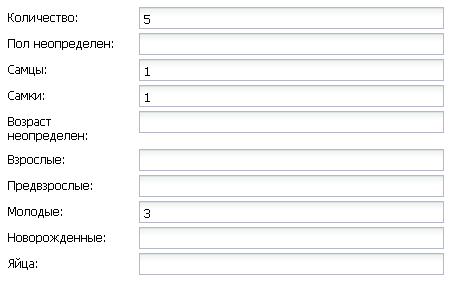

   Пример формализации поло-возрастной структуры, изначальная запись в карточке имела вид: «Пара взрослых + 3-и птенца (сеголетки)».

Заполнение полей характеризующие численность популяций растений и грибов
Для характеристики численности растительных объектов в ИС предусмотрено 3 поля:

1. Количество - абсолютное количество особей.

2. Количество (баллы) - Для быстрого и уверенного определения количественного присутствия вида на площадке, в случае отсутствия возможности прямого подсчета особей. Изначально была попытка использовать шкалу Друде, но это вызвало затруднения у пользователей, к тому же, эта шкала не очень применима для редких видов. Разработана упрощенная четырехбалльная шкала со следующими градациями:

- единственный экземпляр – найдена единственная особь вида.
- разрозненные особи – на площадке найдено более одной особи, растения возможно обнаружить лишь при очень тщательном осмотре площадки.
- локальное сообщество – растения данного вида заметны на площадке даже без тщательного поиска, но не составляют существенного процента проективного покрытия (<5%).
- ценозообразующий вид – проективное покрытие вида более 5%, кроме того, растения данного вида регулярно попадаются за пределами площадки, на б.м. обширных площадях.

3. Площадь ценопопуляции - площадь в квадратных метрах. 

Работа с картами-схемами
------------------------

Карта-схема «точки встреч краснокнижного вида»
~~~~~~~~~~~~~~~~~~~~~~~~~~~~~~~~~~~~~~~~~~~~~~

Схема точечного ареала вида автоматически генерируется из таблицы БД «Карточки учета 
краснокнижного вида» при выборе вида пользователем из навигационной панели дерева таксонов 
или посредством панели поиска по таксонам. 
В гостевом режиме расположение точек встреч смещается на случайную величину в диапазоне 10 км. 
В режимах редактора и администратора, позиционирование точек точное (согласно имеющимся в БД координатам).

Чтобы получить карту-схему необходимого таксона, необходимо:

- в панели «слои» поставить галочку «карточки наблюдений»,
- выбрать таксон посредством панели дерева таксонов или панели поиска по таксонам.

В случае большого скопления точек встреч на ограниченной территории, точки группируются в кластеры, 
число попавших в кластер точек отображается соответствующим числом поверх точки и размерами точки-кластера. 
Список всех карточек, попавших в кластер, можно получить с помощью клика мыши.

Путем нажатия кнопок изменения масштаба (:numref:`ngbio_map_fungi`) можно увеличивать и 
уменьшать масштаб карты-схемы (изменять масштаб можно также с помощью колесика мыши).

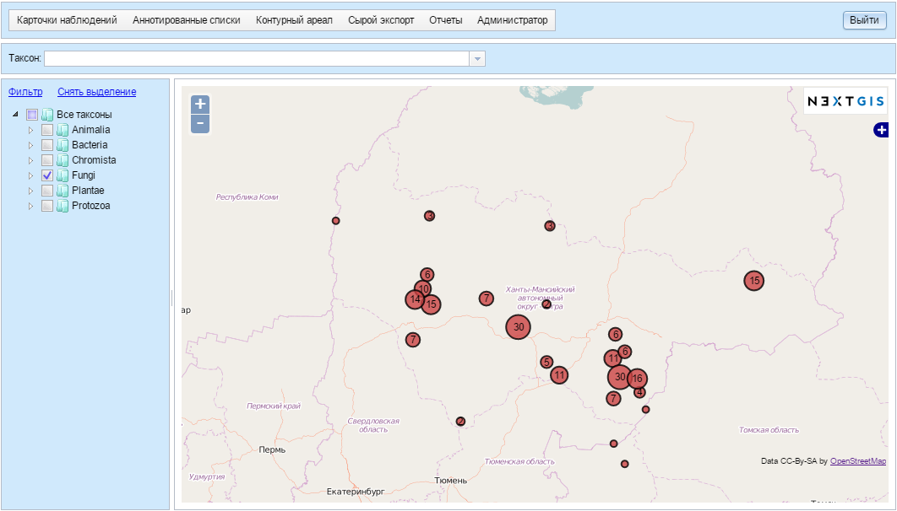

   Карта-схема точек встреч всех видов грибов (в качестве таксона для отображения выбрано царство грибов - Fungi).
   1 - кнопки изменения масштаба карты;
   2 - список всех карточек видов грибов попавших в один из кластеров: указаны номера
   карточек и латинские названия краснокнижных видов.

Просмотр и редактирование карточек
~~~~~~~~~~~~~~~~~~~~~~~~~~~~~~~~~~

При выборе пользователем точки на схеме, появляется форма с атрибутивной информацией о данной конкретной находке. 
В режимах редактора и администратора возможно редактирование созданных ранее карточек. 
Подробнее о редактировании полей карточек см. раздел «Создание и редактирование карточек встреч краснокнижных видов».

Экспорт карты схемы
~~~~~~~~~~~~~~~~~~~

После выбора необходимого таксона (таксонов), всю первичную информацию можно экспортировать 
в текстовый файл с разделителями. Такой файл можно импортировать в любое аналитическое ПО, 
например в MS Excel в виде таблицы. 
Для экспорта в CSV необходимо:

- на редакторской панели ИС нажать кнопку «карточки наблюдений»,
- выбрать пункт «экспорт в csv»,
- после нажатия кнопки в браузере появится диалоговое окно сохранения файла (может отличаться, в зависимости от используемого браузера), где необходимо выбрать пункт «сохранить»,
- далее сохраненный файл можно открывать как в обычном текстовом редакторе, так и импортировать в другое ПО.

Также возможен экспорт в ГИС формат ESRI-шейп (SHP): 
последовательность действий та же, но на последнем этапе необходимо выбрать пункт «экспорт в shp». 
В результате экспорта будут сгенерированы все необходимые элементы шейп-файла, 
который можно открыть практически в любой современной ГИС. Следует отметить, что в отличие 
от экспорта в формат CSV, при экспорте в шейп-файл, будут экспортированы не все записи, а лишь те, у которых были заполнены поля широта/долгота.

Карта-схема «контурный ареал вида»

Схема контурного ареала вида автоматически генерируется из БД при выборе вида пользователем на 
навигационной панели дерева таксонов или посредством панели поиска по таксонам (:numref:`ngbio_map_betula_area`).
Результирующая карта-схема представляет из себя совокупность всех ячеек сетки, для которых 
вид указан в БД (таблица аннотированный список).

Чтобы получить карту-схему необходимого таксона, необходимо:

- в панели «слои» поставить галочку «контурный ареал вида»,
- выбрать таксон посредством панели дерева таксонов или панели поиска по таксонам.

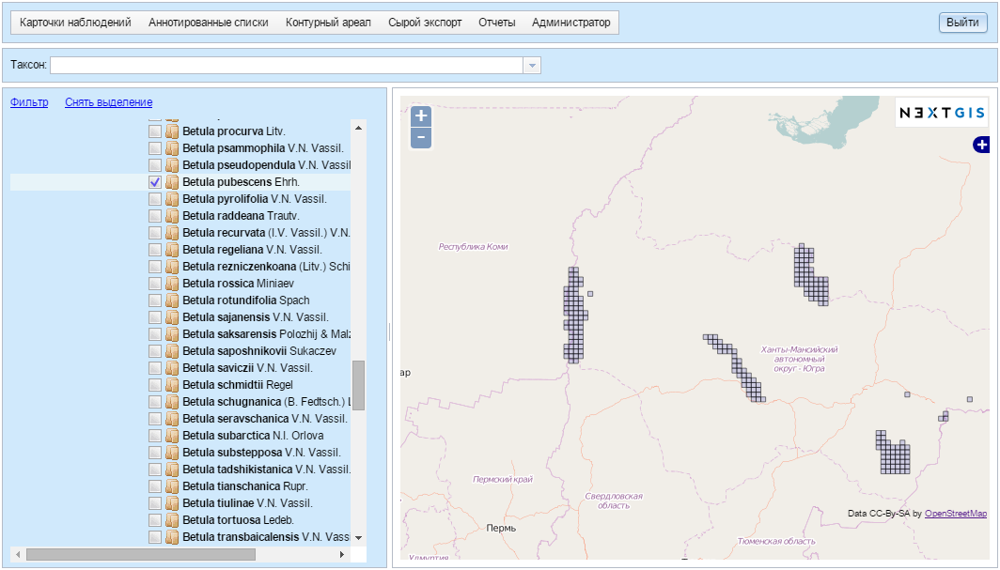

   Карта-схема контурного ареала вида на примере Березы пушистой (Betula pubescens Ehrh.).

Щелкнув на квадрате полигональной сетки, можно посмотреть или отредактировать аннотацию к данному таксону (:numref:`ngbio_map_annt`).
 
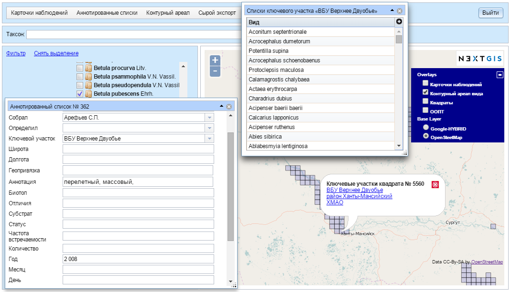

   Редактирование аннотированного списка и просмотр ключевых участков выбранного квадрата.

Карта-схема контурного ареала может быть экспортирована в шейп-файл. Для этого после создания карты на панели редактора нужно нажать кнопку «Контурный ареал» -> «Экспорт в shp».

Карта-схема «аннотированный список»
~~~~~~~~~~~~~~~~~~~~~~~~~~~~~~~~~~~

Служит для просмотра списка необходимых таксонов, вплоть до полного списка видов в конкретной точке карты-схемы или для всего округа. 

Пример 1.  Аннотированный список в точке.
Пусть нам необходимо получить аннотированный список всех жужелиц в определенной точке округа, для этого необходимо:

- в панели «слои» поставить галочку «контурный ареал вида»,
- выбрать необходимый таксон (семейство Carabidae) на панели поиска по таксонам,
- щелкнуть мышью на интересующем участке карты-схемы, после чего появится список видов жужелиц для конкретного квадрата полигональной сетки,
- щелкая по видам в появившемся аннотированном списке, можно просматривать имеющуюся информацию.

Пример 2.  Аннотированный список таксона для всего округа.
Пусть нам необходимо посмотреть аннотированный список всех жужелиц для округа, для этого необходимо:

- в панели «слои» поставить галочку «контурный ареал вида»,
- выбрать необходимый таксон (семейство Carabidae) на панели поиска по таксонам,
- на панели редактора нужно нажать кнопку «Аннотированные списки» -> «Экспорт в csv». 
- В результате получается текстовый файл с разделителями табуляции, который можно анализировать в любом табличном редакторе, например, Excel.

Расшифровка подписей колонок таблицы «Аннотированный список»:

- id - идентификационный номер записи в БД
- species - латинское название таксона принятое в БД
- key_area - название ключевого участка, на котором был отмечен таксон
- identifier - кто определил
- collecter - кто собрал
- biblioref - библиографическая ссылка
- original_name - таксон в понимании автора статьи (источника информации) посли обработки синонимики внутри БД.
- location - геопривязка
- lon - долгота
- lat - широта
- biotop - биотоп
- difference - отличия (поле заполняется, в случае, если найденный таксон лишь условно отнесен к данному виду, описываются отличия от типа, данная информация встречается в статьях по грибам).
- substrat  - субстрат
- status - статус организма на территории, например «залетный вид» для птиц
- frequency - частота встреч
- quantity - количество
- annotation - аннотация (сложно формализуемая текстовая информация)
- infosourse - источник информации
- year - год
- month - месяц
- day - день
- exposure - время экспозиции ловушек в сутках.

Подсчет карточек на заданный полигон
~~~~~~~~~~~~~~~~~~~~~~~~~~~~~~~~~~~~

При работе с основной картосхемой доступен инструмент, позволяющий осуществить подсчет карточек на заданном полигоне (:numref:`cards_polygon_001`).

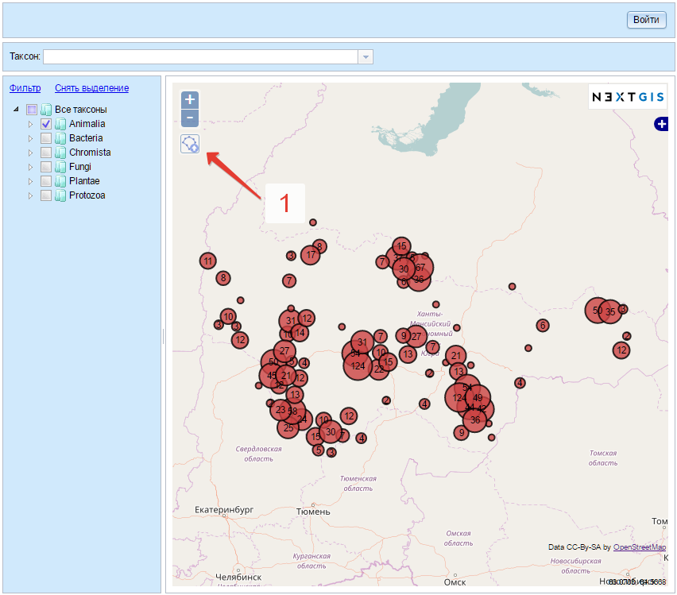

   Инструмент для подсчета карточек на заданном полигоне

После щелчка левой кнопкой мыши по иконке инструмента отображается окно, содержащее кнопку для
выбора файла в формате GeoJSON, который должен содержать полигон для осуществления расчета (:numref:`cards_polygon_002`).

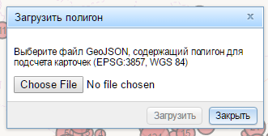

   Окно выбора файла для загрузки целевого полигона

Основные требования к файлу:

- файл должен содержать один простой полигон (мультиполигоны не поддерживаются)
- файл должен быть в формате GeoJSON (в QGIS создается путем экспорта в файл с выбором формата GeoJSON)
- файл должен содержать координаты точек в проекции EPSG 3857 / WGS 84 (при экспорте в QGIS необходимо выбрать целевую проекцию EPSG:3857, WGS 84 / Pseudo Mercator)

После выбора файла необходимо щелкнуть левой кнопкой мыши по кнопке "Загрузить". Система отобразит полигон (1) и всплывающее окно (2), в котором будет отображены
количество карточек внутри полигона (3) и кнопка-ссылка "Пересчитать" (4) (:numref:`cards_polygon_003`).

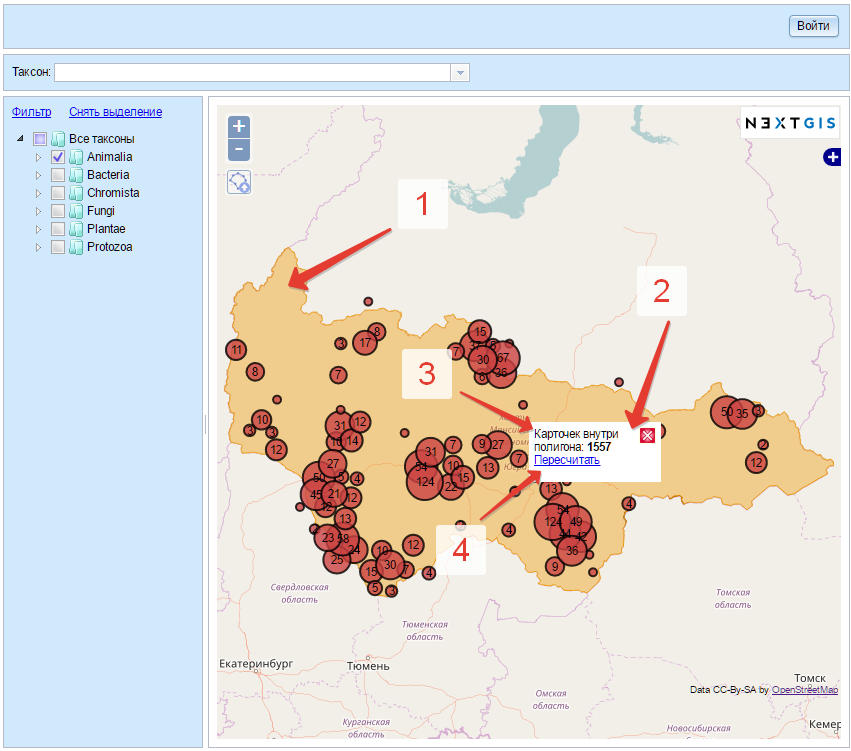

   Пример отображения загруженного полигона и окна с результатами расчета (пояснения см. в тексте)

При изменении набора отображаемых таксонов возникает необходимость пересчета количества карточек внутри загруженного полигона.
Для этого необходимо кликнуть левой кнопкой мыши по кнопке-ссылке "Пересчитать" и система осуществит перерасчет с учетом актуального
набора выбранных в дереве таксонов.

Работа с отчетами
-----------------

Отчет о внесении карточек
~~~~~~~~~~~~~~~~~~~~~~~~~

Отчет о внесении карточек доступен любому зарегистрированному в системе пользователю через пункт меню "Отчеты" -> "Внесение карточек" (:numref:`reports_added_cards_001`).

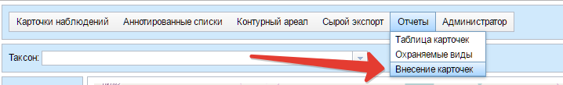

   Пункт меню для доступа к отчету о внесении карточек

После нажатия на пункт меню "Внесение карточек" пользователь перенаправляется на страницу отчета (:numref:`reports_added_cards_002`).

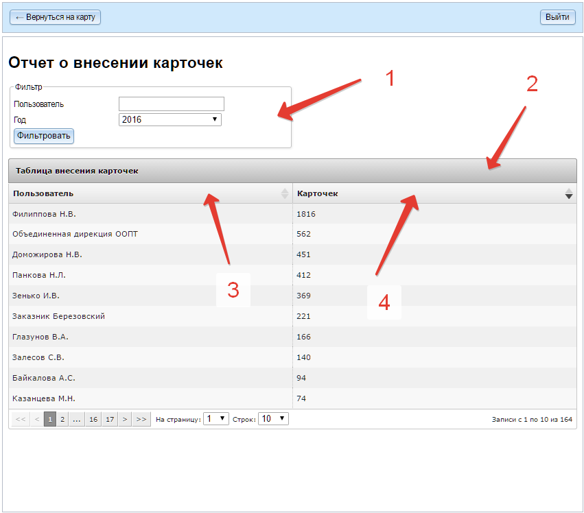

   Внешний вид страницы отчета о внесении карточек

Страница состоит из следующих структурных частей:

- область фильтра (1);
- таблицы с информации о внесении карточек (2), состоящей из столбцов, содержащих краткие инициалы исследователя (3) и количество карточек (4), внесенных им за выбранный в фильтре (1) год.

Столбцы таблицы являются сортируемыми. Инструменты фильтрации позволяют выбирать записи за определенный год, а также
производить отобор записей по фильтру кратких инициалов исследователя. Также в таблице доступен постраничный вывод
строк с возможностью указания количества строк на странице.